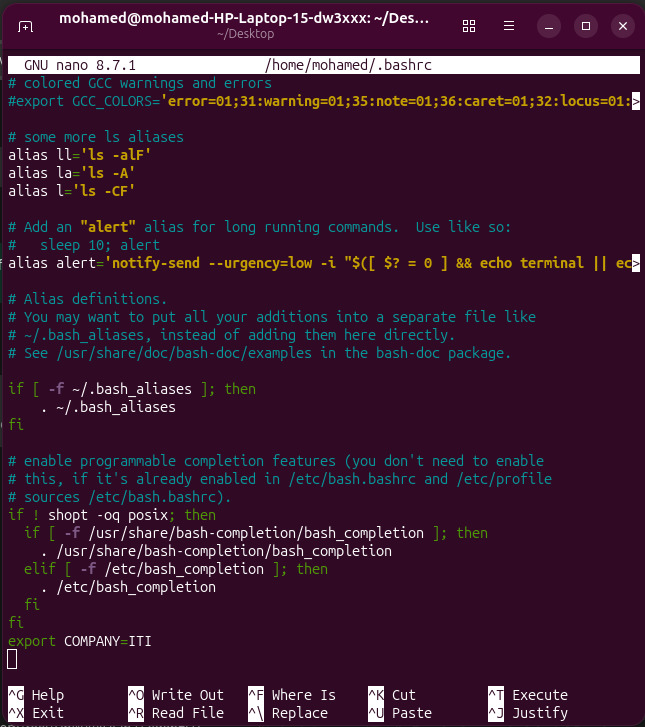

# 🌍 Assignment 2 – Environment Variable Mystery


## 📖 Overview

This assignment focuses on understanding **Linux environment variables** and how they are inherited by different shell processes. The objective is to create a custom environment variable, verify its availability across different shell sessions, and make it persistent so that it is automatically loaded whenever a new terminal is opened.

---

## 🎯 Objectives

- Create a custom environment variable.
- Verify it in the current shell.
- Verify it in a child shell.
- Verify it after opening a new terminal.
- Make the variable persistent.
- Explain the purpose of the modified startup file.

---

## 🛠️ Implementation

### 1️⃣ Create the Environment Variable

```bash
export COMPANY=ITI
```

Verify the variable:

```bash
echo $COMPANY
```

Output:

```text
ITI
```

---

### 2️⃣ Verify in the Current Shell

The variable is immediately available in the current shell.

```bash
echo $COMPANY
```

---

### 3️⃣ Verify in a Child Shell

Start a child Bash shell:

```bash
bash
```

Check the variable:

```bash
echo $COMPANY
```

Since the variable was exported, it is inherited by the child shell.

Exit the child shell:

```bash
exit
```

---

### 4️⃣ Make the Variable Persistent

Edit the Bash configuration file:

```bash
nano ~/.bashrc
```

Append the following line:

```bash
export COMPANY=ITI
```

Reload the configuration:

```bash
source ~/.bashrc
```

---

### 5️⃣ Verify in a New Terminal

Open a completely new terminal window and run:

```bash
echo $COMPANY
```

Expected output:

```text
ITI
```

This confirms that the variable is loaded automatically whenever a new Bash session starts.

---

## 💡 Why `~/.bashrc`?

The `~/.bashrc` file is executed every time a new **interactive Bash shell** starts. Since terminal windows launch interactive Bash sessions, placing the `export COMPANY=ITI` command inside this file ensures the environment variable is automatically available in every new terminal without requiring manual configuration.

---

## 📂 Project Structure

```text
Assignment2/
├── README.md
└── screenshot.jpeg
```

---

## 📸 Screenshot

The screenshot below shows the **`~/.bashrc`** configuration file after adding the following line to make the `COMPANY` environment variable persistent across all future Bash sessions.

<p align="center">
  
</p>

```bash
export COMPANY=ITI
```

---

## ✅ Result

Successfully completed the assignment by:

- ✔️ Creating the `COMPANY` environment variable.
- ✔️ Verifying it in the current shell.
- ✔️ Verifying it in a child shell.
- ✔️ Making it persistent using `~/.bashrc`.
- ✔️ Configuring Bash to automatically load the `COMPANY` environment variable for every new terminal session.
