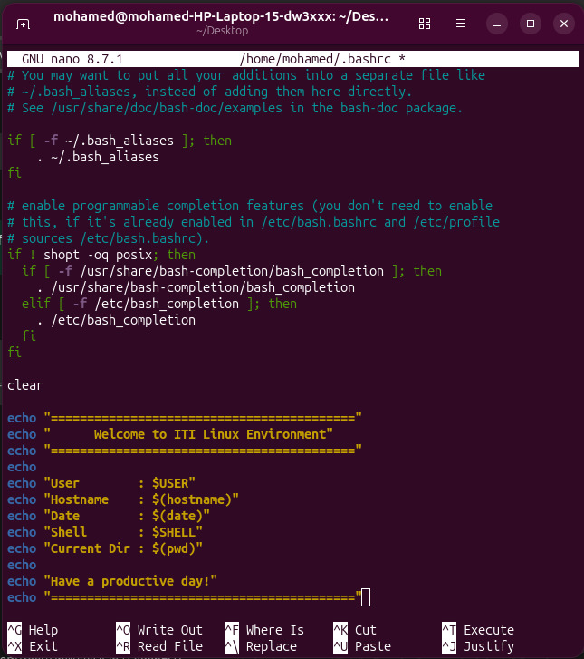
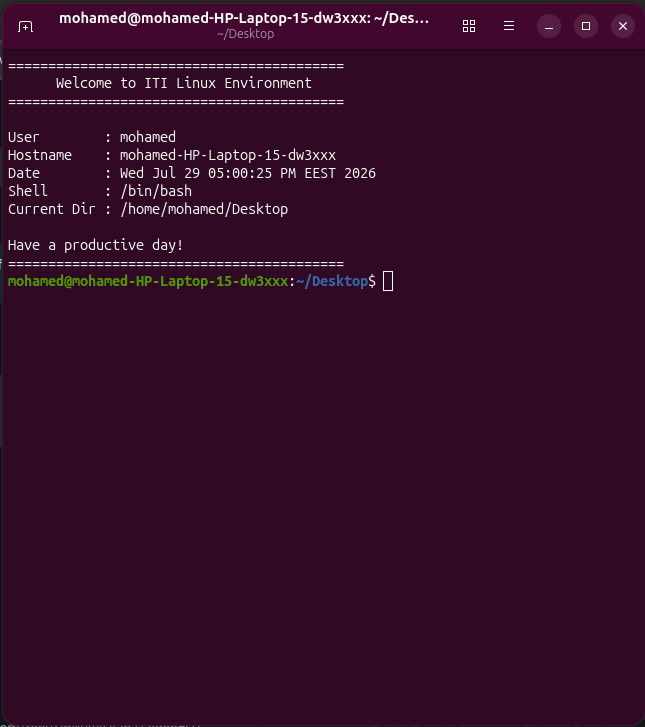

# 🖥️ Assignment 3 – Build Your Own Linux Shell Environment


## 📖 Overview

This assignment customizes the Bash shell environment by displaying a dynamic welcome screen every time a new terminal session starts. The welcome screen automatically displays useful system information such as the current user, hostname, date, shell, and working directory.

---

## 🎯 Objectives

- Customize the Bash startup environment.
- Display a personalized welcome screen.
- Show dynamic system information.
- Automatically execute the welcome screen whenever a new terminal is opened.

---

## 🛠️ Implementation

The welcome screen was added to the `~/.bashrc` file so it executes automatically whenever a new interactive Bash shell starts.

### Welcome Screen Script

```bash
clear

echo "=========================================="
echo "      Welcome to ITI Linux Environment"
echo "=========================================="
echo
echo "User        : $USER"
echo "Hostname    : $(hostname)"
echo "Date        : $(date)"
echo "Shell       : $SHELL"
echo "Current Dir : $(pwd)"
echo
echo "Have a productive day!"
echo "=========================================="
```

After editing the configuration file, the changes were applied using:

```bash
source ~/.bashrc
```

---

## ⚙️ Dynamic Information Displayed

| Information       | Command / Variable |
| ----------------- | ------------------ |
| User              | `$USER`            |
| Hostname          | `$(hostname)`      |
| Date & Time       | `$(date)`          |
| Current Shell     | `$SHELL`           |
| Current Directory | `$(pwd)`           |

---

## 💡 Why `~/.bashrc`?

The `~/.bashrc` file is executed automatically whenever a new interactive Bash shell starts. By placing the welcome screen script inside this file, every newly opened terminal automatically displays the customized environment without requiring any manual execution.

---

## 📂 Project Structure

```text
Assignment3/
├── README.md
├── screenshot.jpeg
└── screenshot1.jpeg
```

---

## 📸 Screenshots

### 1️⃣ Bash Configuration (`~/.bashrc`)

The following screenshot shows the Bash configuration file after adding the welcome screen script.

<p align="center">
    
</p>

---

### 2️⃣ Welcome Screen Output

The following screenshot demonstrates the customized welcome screen that appears automatically whenever a new terminal session starts.

<p align="center">
    
</p>

---

## ✅ Result

Successfully customized the Bash shell environment to:

- ✔️ Display a welcome screen automatically.
- ✔️ Show the current user.
- ✔️ Display the system hostname.
- ✔️ Display the current date and time.
- ✔️ Display the current shell.
- ✔️ Display the current working directory.
- ✔️ Execute automatically whenever a new interactive Bash terminal starts.

---

## 📚 Technologies Used

- Linux
- Bash Shell
- Bash Environment Variables
- Bash Startup Configuration (`.bashrc`)
