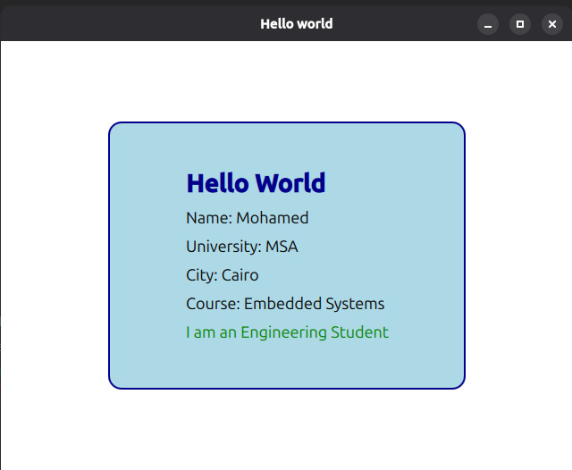

# 🖥️ Task 1 – Qt Quick Personal Information Window


## 📖 Overview

This task demonstrates the basics of creating a graphical user interface using **Qt Quick and QML**.

The application creates a simple window containing a styled rectangle with personal information displayed using multiple text components. It introduces the fundamentals of QML layouts, UI elements, styling, and positioning.

---

## 🎯 Objectives

- Create a Qt Quick application using QML.
- Understand the structure of a QML file.
- Create and configure a main application window.
- Use `Rectangle` as a UI container.
- Arrange elements using `Column` layout.
- Display text using `Text` components.
- Apply basic styling such as:
  - Colors
  - Borders
  - Rounded corners
  - Font customization
- Build and run a cross-platform Qt application.

---

## 🖼️ Application Preview



---

## 🛠️ Implementation

### Main QML File

```qml
import QtQuick
import QtQuick.Layouts
import QtQuick.Controls.Basic


Window {
    width: 640
    height: 480
    visible: true
    title: qsTr("Hello world")

    Rectangle {
        width: 400
        height: 300
        anchors.centerIn: parent
        color: "lightblue"
        radius: 15
        border.color: "darkblue"
        border.width: 2

        Column {
            anchors.centerIn: parent
            spacing: 10

            Text {
                text: "Hello World"
                font.pixelSize: 28
                font.bold: true
                color: "darkblue"
            }

            Text {
                text: "Name: Mohamed"
                font.pixelSize: 18
            }

            Text {
                text: "University: MSA"
                font.pixelSize: 18
            }

            Text {
                text: "City: Cairo"
                font.pixelSize: 18
            }

            Text {
                text: "Course: Embedded Systems"
                font.pixelSize: 18
            }

            Text {
                text: "I am an Engineering Student"
                font.pixelSize: 18
                color: "green"
            }
        }
    }
}
```

---

## ▶️ Running the Application

### Open the project using Qt Creator:

1. Open **Qt Creator**.
2. Load the project file.
3. Select the required Qt Kit.
4. Build the project.
5. Run the application.

The application window will display the designed user interface.

---

## 📂 Project Structure

```text
task1/
├── importedcontent/
├── .qmls.ini
├── CMakeLists.txt
├── main.cpp
├── Main.qml
├── README.md
└── screenshot.jpeg
```

---

## 📚 QML Concepts Used

- `Window`  
  - Creates the main application window.

- `Rectangle`
  - Used as a container with customizable appearance.
  - Supports:
    - Width and height
    - Colors
    - Border
    - Rounded corners

- `Column`
  - Automatically arranges child elements vertically.

- `Text`
  - Displays text information on the interface.

- `anchors.centerIn`
  - Centers an item relative to its parent.

- `font.pixelSize`
  - Controls text size.

- `font.bold`
  - Makes text bold.

- `radius`
  - Creates rounded rectangle corners.

- `border.color` and `border.width`
  - Adds a border around UI elements.

---

## ✅ Result

Successfully created a Qt Quick application that:

- ✔️ Creates a graphical application window.
- ✔️ Uses QML for UI development.
- ✔️ Displays personal information using text components.
- ✔️ Uses layouts for organizing UI elements.
- ✔️ Applies custom styling to the interface.
- ✔️ Runs successfully using Qt Creator.

---

## 📚 Technologies Used

- Qt Framework
- Qt Quick
- QML
- Qt Creator
- Qt Quick Controls
- Qt Quick Layouts
