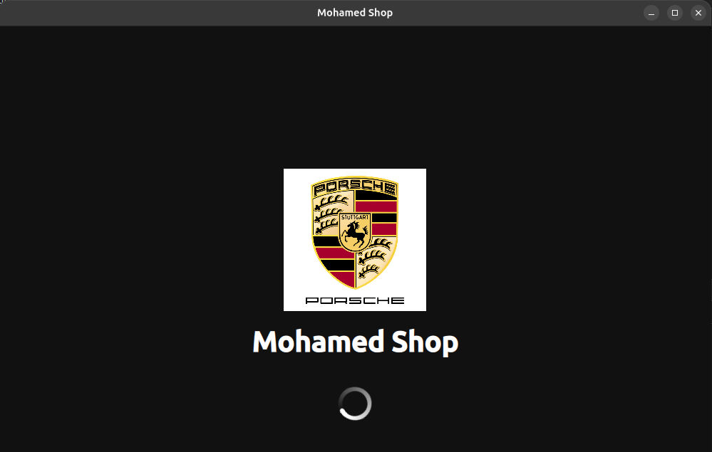
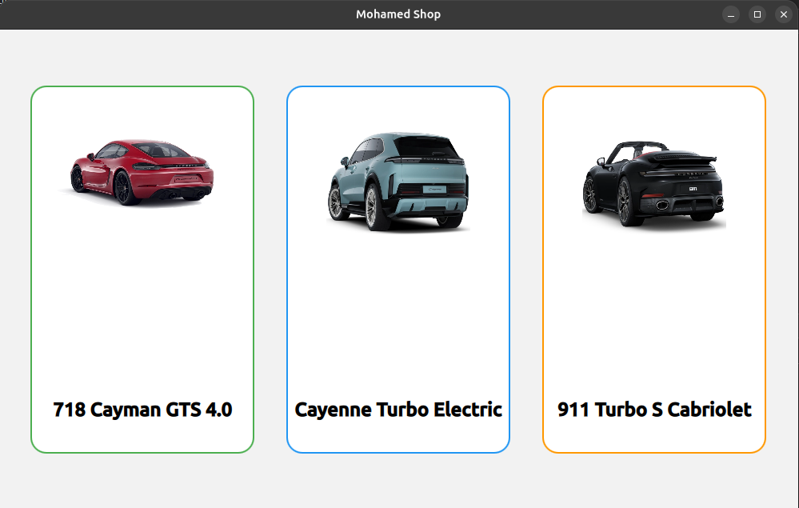
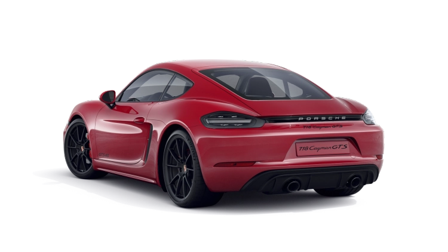
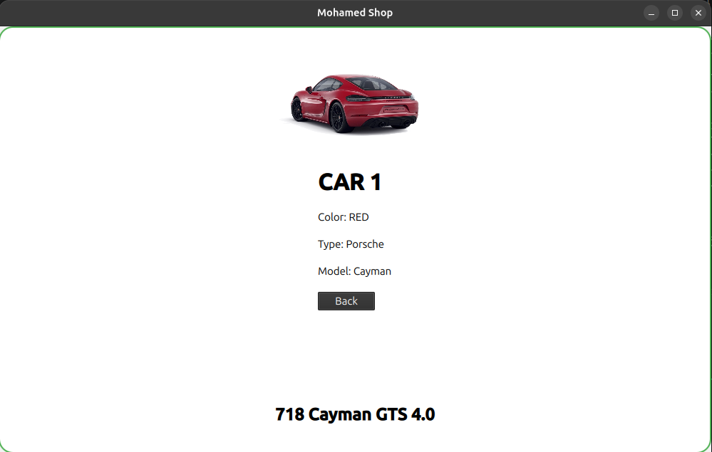
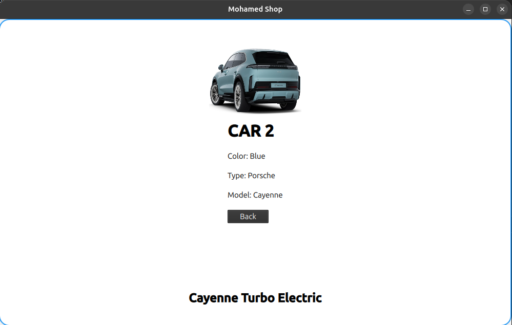
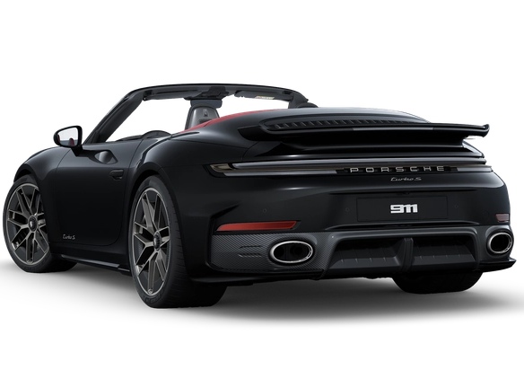
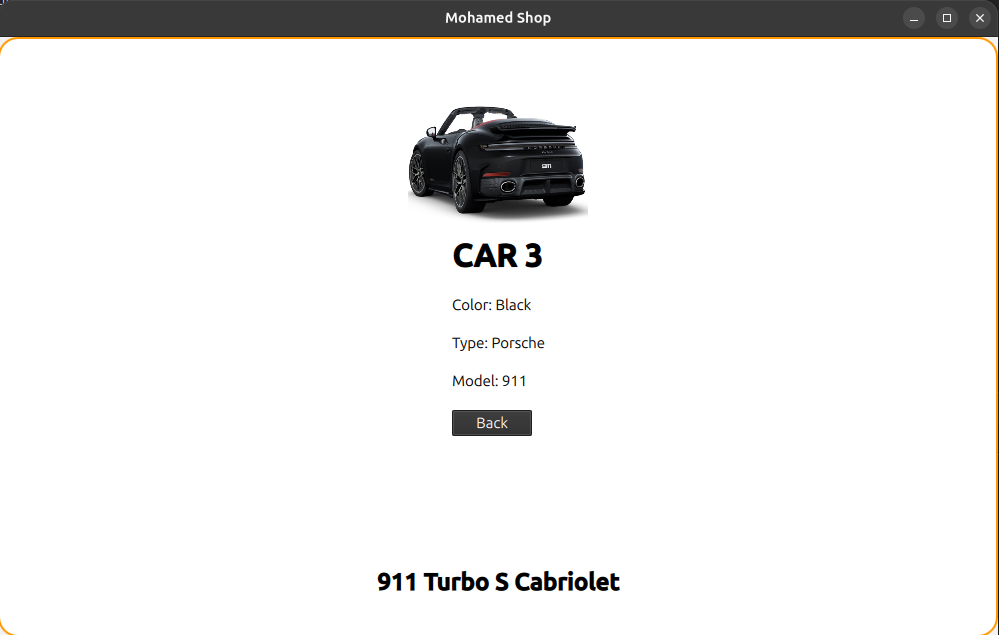

# 🚗 Mohamed Shop – Porsche E-Commerce UI (Qt Quick)


---

## 📖 Overview

**Mohamed Shop** is a Porsche-themed e-commerce user interface built using **Qt Quick and QML**.

The project focuses on creating a modern shopping application design without using a database or backend system. The main goal is to practice building interactive graphical interfaces using QML components, images, layouts, and user interaction.

The application starts with a custom splash screen containing the Porsche logo, application name, and loading animation. After the loading period, the user is taken to the main shop interface where three Porsche vehicles are displayed as interactive product cards.

Each product card allows the user to select a vehicle and view additional information about it.

---

# 🎯 Objectives

The objectives of this project are:

- Learn the basics of Qt Quick application development.
- Understand the structure of QML files.
- Create a complete graphical user interface.
- Design product cards similar to e-commerce applications.
- Use images as visual product representations.
- Add user interaction using mouse events.
- Manage different application states using visibility control.
- Create a professional splash screen experience.
- Practice UI positioning and styling.

---

# ✨ Features

## 🏁 Splash Screen

The application begins with a custom startup screen.

Features:

- Porsche logo display.
- Application branding.
- Dark themed background.
- Animated loading spinner.
- Automatic transition to the main interface.

Screenshot:



---

# 🛒 Main Shop Interface

After the splash screen, the user enters the main product selection page.

The interface contains three Porsche vehicle cards displayed in a landscape layout.

Screenshot:



---

# 🚗 Available Vehicles

## 🚘 Porsche 718 Cayman GTS 4.0

The first product card displays the Porsche 718 Cayman GTS 4.0.

Features:

- Product image.
- Vehicle name.
- Custom styled card.
- Click interaction.
- Detailed information page.

Product Image:



Details Screen:



---

## ⚡ Porsche Cayenne Turbo Electric

The second product card displays the Porsche Cayenne Turbo Electric.

Features:

- Product image.
- Vehicle name.
- Custom styled card.
- Click interaction.
- Detailed information page.

Product Image:

.png)

Details Screen:




---

## 🏎️ Porsche 911 Turbo S Cabriolet

The third product card displays the Porsche 911 Turbo S Cabriolet.

Features:

- Product image.
- Vehicle name.
- Custom styled card.
- Click interaction.
- Detailed information page.

Product Image:



Details Screen:



---

# 🖥️ User Interface Design

The application uses a landscape layout designed for a wide display.

The design includes:

- Rounded product cards.
- Clean background.
- Large vehicle images.
- Custom borders.
- Organized spacing.
- Simple navigation flow.

The interface follows the same concept used in many modern shopping applications:

1. Display products.
2. Select a product.
3. Show product information.

---

# ⚙️ Application Flow

The application works as follows:

```
Application Start
        |
        v
   Splash Screen
        |
        v
 Loading Animation
        |
        v
 Main Product Menu
        |
        v
 Select Vehicle
        |
        v
 Vehicle Details
```

---

# 🛠️ Implementation

The complete application is created using **QML**.

The project uses several Qt Quick components:

## ApplicationWindow

Used as the main application container.

Responsible for:

- Window size.
- Application title.
- Main interface.

---

## Rectangle

Used to create:

- Background.
- Product cards.
- Splash screen.

Supports:

- Colors.
- Borders.
- Rounded corners.
- Custom dimensions.

---

## Image

Used for displaying:

- Porsche logo.
- Vehicle images.

The images are scaled and positioned using QML properties.

---

## Text

Used for:

- Application title.
- Product names.
- Vehicle information.

---

## MouseArea

Used to detect user clicks.

When a user selects a vehicle:

- Other cards are hidden.
- The selected product view is displayed.
- Additional information appears.

---

## BusyIndicator

Used to create the spinning loading animation on the splash screen.

---

## Timer

Used to control the splash screen duration before opening the shop interface.

---

# 📂 Project Structure

```
task-02/
│
├── README.md
│
├── Assests/
│   │
│   ├── car1.png
│   ├── car2.png
│   ├── car3.png
│   ├── splash.png
│   └── main_menu.png
│
└── task2/
    │
    ├── .qtcreator/
    │
    ├── build/
    │
    ├── importedcontent/
    │
    ├── 911.png
    ├── cayturboE (Copy).png
    ├── iris.png
    ├── porsche-logo-png_seeklogo-168544.png
    │
    ├── CMakeLists.txt
    ├── main.cpp
    ├── Main.qml
    └── Resources.qrc
```

---

# 📄 File Description

| File / Folder | Description |
|---|---|
| `Main.qml` | Main QML file containing the complete user interface, splash screen, product cards, and car details pages. |
| `main.cpp` | C++ entry point that launches the Qt Quick application. |
| `CMakeLists.txt` | CMake configuration file used to build the Qt project. |
| `Resources.qrc` | Qt resource file that stores application images and resources. |
| `iris.png` | Image resource for the Porsche 718 Cayman GTS 4.0 product card. |
| `cayturboE (Copy).png` | Image resource for the Porsche Cayenne Turbo Electric product card. |
| `911.png` | Image resource for the Porsche 911 Turbo S Cabriolet product card. |
| `porsche-logo-png_seeklogo-168544.png` | Logo image used in the splash screen. |
| `Assests/` | Contains screenshots used in the README documentation. |
| `splash.png` | Screenshot of the splash screen. |
| `main_menu.png` | Screenshot of the main shop interface. |
| `car1.png` | Screenshot of Porsche Cayman details. |
| `car2.png` | Screenshot of Porsche Cayenne details. |
| `car3.png` | Screenshot of Porsche 911 details. |
| `.qtcreator/` | Qt Creator project configuration files. |
| `build/` | Generated build files created by Qt Creator. |

---

# ▶️ Running the Application

To run the project:

1. Open **Qt Creator**.
2. Load the project.
3. Select the correct Qt Kit.
4. Build the application.
5. Run the program.

The application will start with the splash screen and then display the Porsche shop interface.

---

# 📚 QML Concepts Used

The project demonstrates:

- `ApplicationWindow`
  - Creating the main application window.

- `Rectangle`
  - Building custom UI containers and cards.

- `Image`
  - Displaying external resources.

- `Text`
  - Showing labels and information.

- `Column`
  - Organizing information vertically.

- `MouseArea`
  - Handling user interaction.

- `BusyIndicator`
  - Creating loading animations.

- `Timer`
  - Controlling automatic transitions.

- `Anchors`
  - Positioning UI elements.

- `Visible Property`
  - Switching between application views.

---

# 🚀 Future Improvements

Possible future additions:

- Shopping cart system.
- Product prices.
- Search bar.
- Favorite button.
- More Porsche models.
- Smooth animations.
- Database connection.
- User accounts.
- Checkout page.
- Responsive layouts.

---

# ✅ Result

Successfully created a Porsche-inspired e-commerce interface using Qt Quick and QML.

The final application includes:

✅ Custom splash screen  
✅ Loading animation  
✅ Landscape UI design  
✅ Product cards  
✅ Interactive selection  
✅ Vehicle details pages  
✅ Image-based interface  
✅ QML user interaction  
✅ Qt Creator compatibility  

---

# 📚 Technologies Used

- Qt Framework
- Qt Quick
- QML
- Qt Creator
- Qt Quick Controls
- Qt Quick Layouts
- CMake